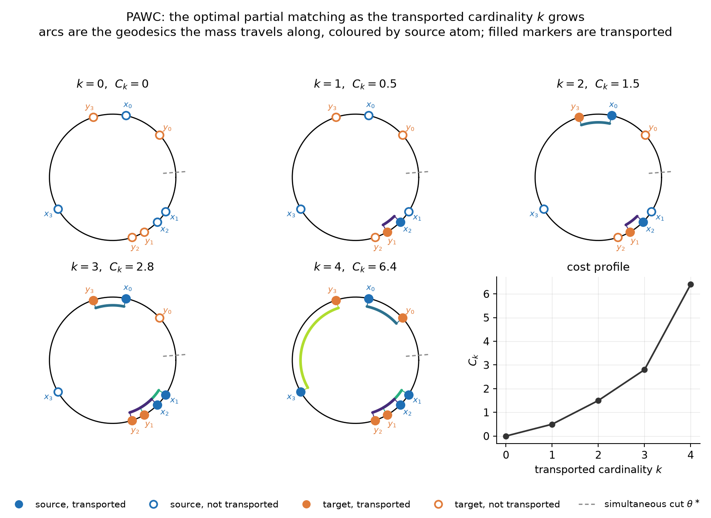
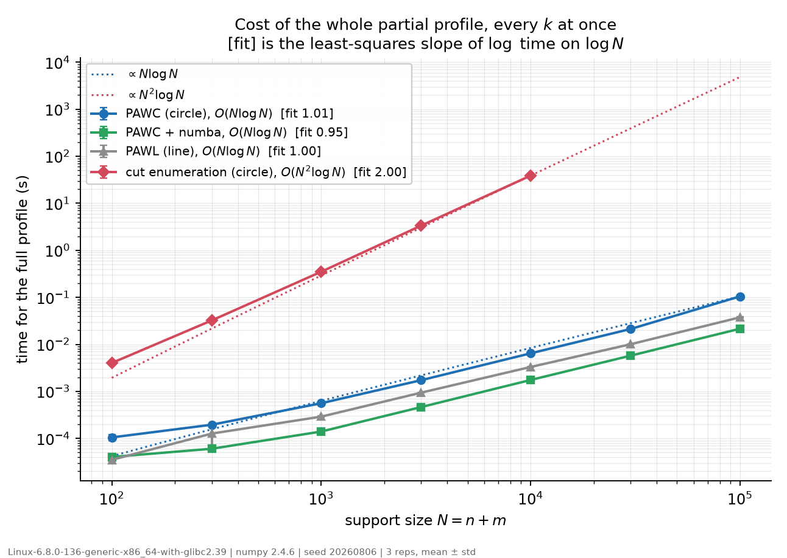

# Partial Wasserstein on the Circle (PAWC)

Exact partial 1-Wasserstein transport between two uniformly weighted empirical
measures on a circle with the geodesic ground cost — **for every transported
cardinality `k` at once**, in **O(N log N)** time and **O(N)** memory.

The naive approach cuts the circle at each of the `N` inter-atom gaps, runs a line
solver at each cut, and takes the lower envelope: `O(N² log N)`. PAWC removes that
factor of `N` by showing the line structure survives on the circle in a cut-free
form, and that a *single* gap is optimal simultaneously for every `k`.

Reference implementation for

> Soheil Kolouri. *PAWC: Efficient Computation of Partial Wasserstein Distances on
> the Circle*, 2026.

which extends PAWL to the circle:

> Laetitia Chapel and Romain Tavenard. *One for all and all for one: Efficient
> computation of partial Wasserstein distances on the line.* ICLR 2025.

---

## Install

```bash
conda create -n pawc python=3.11
conda activate pawc
pip install -r requirements.txt
```

The baselines additionally need the PAWL reference implementation, which is **not
redistributed here** (see [Vendored PAWL](#vendored-pawl)):

```bash
python vendor/fetch_pawl.py     # downloads at a pinned commit, verifies SHA-256
```

PAWC itself does not need it.

## Quickstart

```python
import numpy as np
from pawc.pawc import partial_ot_circle

L = 12.0                                    # circumference
x = np.array([0.4, 4.1, 4.5, 8.0])          # sources, in [0, L)
y = np.array([1.6, 5.0, 5.4, 11.4])         # targets, in [0, L)

sol = partial_ot_circle(x, y, L=L, w=1.0)   # one call answers every k

sol.costs           # array([0. , 0.5, 1.5, 2.8, 6.4])  -- C_k for k = 0..K
sol.plan(2)         # the (n, m) transport plan at k = 2, entries in {0, w}
sol.active_x[2]     # which sources are transported at k = 2
sol.cuts[0]         # the simultaneous cut theta*, valid for all k
```

The supports must be pairwise distinct and lie in `[0, L)`; both measures carry the
same atom weight `w`. `K = min(n, m)`.

`sol.costs[k]` is the **total** cost of moving `k` atoms; `sol.costs[k] / (k*w)` is
the average geodesic distance they travel. When `n == m`, `sol.costs[K]` is the full
circular `W₁` cost (up to POT's normalisation — `demos/demo1_walkthrough.py` checks
this against `ot.lp.wasserstein_circle`).

## Demos

### 1. Applying PAWC, and watching the matching grow

```bash
python demos/demo1_walkthrough.py                       # the paper's worked example
python demos/demo1_walkthrough.py --random --n 6 --seed 3
```

Prints the cost profile, every transport plan, and the nested active sets, then
writes `figures/demo1_walkthrough.png` — one circle per `k`, with the geodesic arcs
the mass travels along.



What the figure shows: filled markers are transported atoms, hollow ones are not;
arcs are coloured by source atom; the dashed radial tick is the simultaneous cut
`θ*`. The **active sets** grow monotonically — that is what lets one sweep answer
every `k` — but the **pairing** inside them may change, and the demo prints exactly
where it does. Re-pairing already-active atoms moves no new mass, so it is free.

### 2. What it costs: O(N log N) against O(N² log N)

```bash
python demos/demo2_scaling.py            # ~2 min, to N = 10^5
python demos/demo2_scaling.py --quick    # ~15 s
python demos/demo2_scaling.py --full     # ~30 min, to N = 10^6
```

Times the *whole* profile — every `k` — and writes `figures/demo2_scaling.png` plus
the raw CSV.



Measured slopes of `log(time)` on `log N` on the default sweep:

| solver | problem | complexity | fitted slope | time at N = 10⁴ |
|---|---|---|---|---|
| `pawc` | circle | `O(N log N)` | 1.01 | 6.6 ms |
| `pawc_numba` | circle | `O(N log N)` | 0.95 | 1.8 ms |
| `pawl` (Chapel & Tavenard) | line | `O(N log N)` | 1.00 | 3.3 ms |
| `baseline_cuts` | circle | `O(N² log N)` | 2.00 | 39 s |

Two things to read off. PAWC on the circle costs roughly what PAWL costs on the
line — a constant factor, not an asymptotic one; the JIT version is faster than
PAWL outright. And against the cut-enumeration solver of the same problem it is
~6000× faster at N = 10⁴, with the gap widening by a further factor of ~N per
decade.

A caveat on constants, not slopes: PAWL is numba-JIT compiled upstream, while
`pawc.py` is deliberately pure numpy + stdlib. So `pawc` vs `baseline_cuts` is
*conservative* on the constant factor, and `pawc_numba` is the JIT-to-JIT
comparison. JIT compilation is excluded from all timings by an explicit warm-up.

## Layout

```
pawc/               the package
  circle.py           geometry: wrapping, geodesic distance, sorted union, gaps
  pawc.py             THE SOLVER. Algorithm 1, O(N log N). Pure numpy + stdlib.
  pawc_numba.py       same algorithm, numba-JIT. Bit-identical results.
  pawc_reference.py   readable transcription of Algorithm 1, with the draft's
                      invariants asserted under PAWC_DEBUG=1
  baseline_cuts.py    Baseline B: cut enumeration, O(N^2 log N). Needs PAWL.
  baseline_lp.py      Baseline A: LP / min-cost-flow oracle. Ground truth, slow.
  solution.py         PartialCircleSolution: the common return type
  elbow.py            choosing k by the elbow of the profile
  verify.py           independent recomputation helpers used by the tests
  sspw.py             sliced spherical partial Wasserstein on S^{d-1}
demos/              the two demos above
tests/              94 tests
vendor/             PAWL provenance + fetch script (the file itself is not vendored)
figures/            demo output
```

**Which solver to use:** `pawc.pawc.partial_ot_circle` for everything, or
`pawc.pawc_numba.partial_ot_circle` if numba is available and you are calling it in
a loop. The other three exist to check it.

**Trust hierarchy**, used when solvers disagree:
`baseline_lp` > `baseline_cuts` > `pawc_reference` > `pawc`. A disagreement is
resolved in favour of the more trusted solver until proven otherwise against the LP
oracle. If `baseline_cuts` ever disagrees with the LP oracle, that is a theory-level
finding, not a coding bug.

## Tests

```bash
python -m pytest -q            # 94 tests, ~20 s
PAWC_DEBUG=1 python -m pytest -q   # plus the per-step invariant assertions
```

Covered: agreement with the LP oracle and with cut enumeration across instance
families and fixed seeds; exact-arithmetic (`fractions.Fraction`) cross-checks on
near-tolerance instances; nestedness, the free-gap invariant, cost consistency and
plan feasibility after every induction step; convexity of `k → C_k`; rotation
equivariance and reflection symmetry; and `pawc_numba` matching `pawc` exactly.

Randomised tests use fixed seeds recorded in the test files, and every counterexample
hypothesis has found is kept as a permanent regression case.

## Vendored PAWL

The baselines call the PAWL reference implementation from
<https://github.com/rtavenar/partial_ot_1d>, pinned at commit `849e82e`.

That repository carries **no licence file**, so its code is not copied into this
one. `vendor/fetch_pawl.py` downloads `partial.py` at the pinned commit and verifies
it against the SHA-256 in `vendor/checksums.txt`. Do not edit the downloaded file —
the baseline is deliberately pinned to a known-good line solver. See
`vendor/PROVENANCE.md`.

## Licence

Not yet chosen. Decide before sharing beyond immediate collaborators, and note that
the PAWL dependency above is fetched rather than redistributed precisely so this
repository's licence does not have to speak for it.
